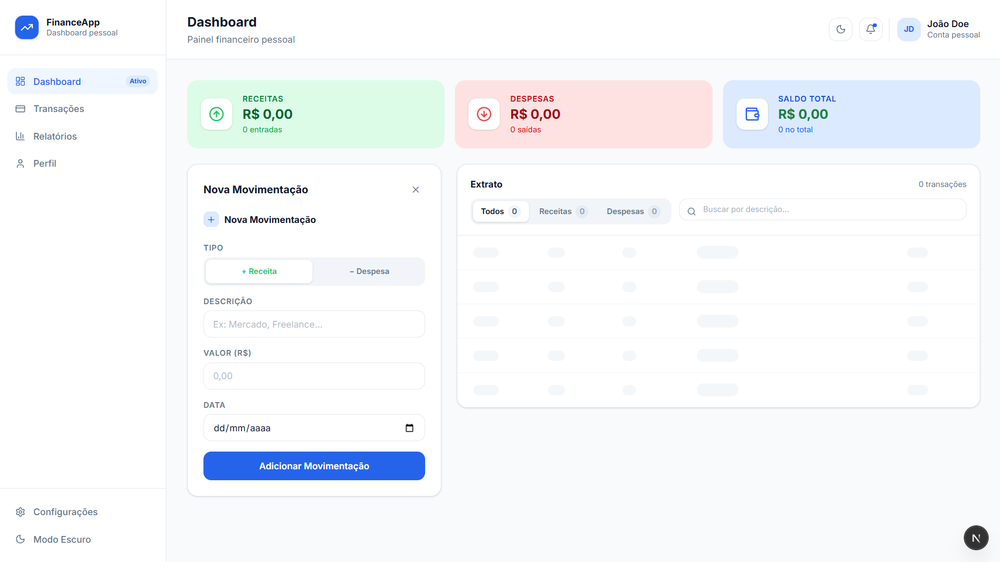
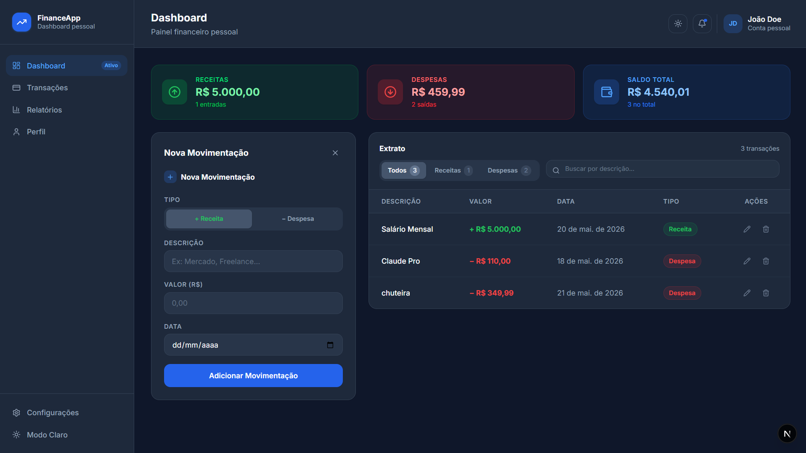
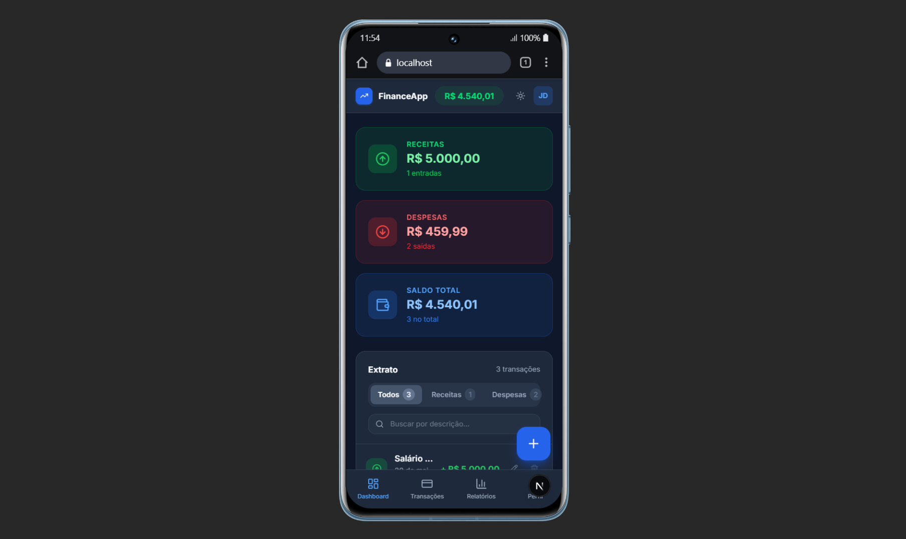
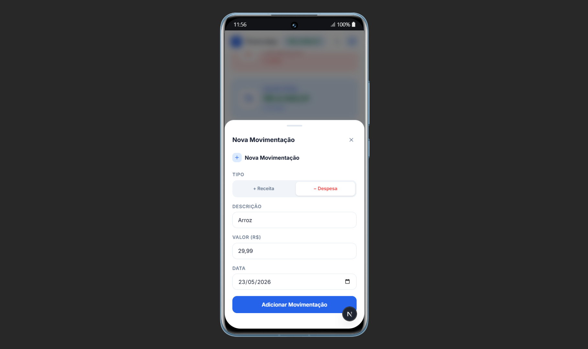

# Gerenciador de Finanças Pessoais

Aplicação full-stack de gestão de finanças pessoais desenvolvida com **Java Spring Boot** e **Next.js**, permitindo ao usuário controlar receitas e despesas por meio de um painel responsivo e moderno.

---

## Funcionalidades

- **Gerenciamento de Transações** — Cadastre, edite e exclua transações financeiras
- **Resumo Financeiro** — Cards em tempo real com total de receitas, despesas e saldo atual
- **Busca e Filtros** — Filtre por tipo (receita/despesa) ou busque por descrição
- **Design Responsivo** — Layout mobile com navegação inferior e formulário em drawer; layout desktop com sidebar e painel lateral
- **Modo Escuro / Claro** — Alternância de tema com persistência via localStorage
- **Formatação Localizada** — Moeda em Real Brasileiro (R$) e datas em português

---

## Tecnologias Utilizadas

### Backend

| Tecnologia                  | Finalidade                            |
| --------------------------- | ------------------------------------- |
| Java 21                     | Linguagem principal                   |
| Spring Boot                 | Framework para API REST               |
| Spring Data JPA / Hibernate | ORM e abstração do banco de dados     |
| PostgreSQL                  | Banco de dados relacional             |
| Maven                       | Gerenciamento de build e dependências |
| Lombok                      | Redução de código boilerplate         |
| UUID                        | Chaves primárias sem colisão          |

### Frontend

| Tecnologia              | Finalidade                        |
| ----------------------- | --------------------------------- |
| Next.js 15 (App Router) | Framework React com suporte a SSR |
| React 19                | Biblioteca de componentes de UI   |
| TypeScript              | Tipagem estática                  |
| Tailwind CSS 4          | Estilização utilitária            |
| Lucide React            | Biblioteca de ícones              |

---

## Arquitetura

```
┌─────────────────────────────────────────────────────────┐
│                      Frontend                           │
│            Next.js · React · TypeScript                 │
│              http://localhost:3000                      │
│                                                         │
│  ┌──────────┐  ┌──────────┐  ┌────────┐  ┌─────────┐  │
│  │  Cards   │  │  Tabela  │  │ Busca  │  │  Tema   │  │
│  │ Resumo   │  │  /Lista  │  │  e     │  │ Escuro/ │  │
│  │          │  │          │  │ Filtro │  │  Claro  │  │
│  └──────────┘  └──────────┘  └────────┘  └─────────┘  │
└─────────────────────────┬───────────────────────────────┘
                          │ REST (JSON)
                          │ CORS: localhost:3000
                          ▼
┌─────────────────────────────────────────────────────────┐
│                       Backend                           │
│            Spring Boot · Java 21 · Maven                │
│              http://localhost:8080                      │
│                                                         │
│  Controller → Service → Repository → Entidade JPA      │
│                                                         │
│   GET    /api/transacoes                               │
│   POST   /api/transacoes                               │
│   PUT    /api/transacoes/{id}                          │
│   DELETE /api/transacoes/{id}                          │
└─────────────────────────┬───────────────────────────────┘
                          │
                          ▼
              ┌───────────────────────┐
              │       PostgreSQL      │
              │      finance_db       │
              └───────────────────────┘
```

---

## Documentação da API

### `GET /api/transacoes`

Retorna todas as transações cadastradas.

**Resposta `200 OK`**

```json
[
  {
    "id": "3fa85f64-5717-4562-b3fc-2c963f66afa6",
    "descricao": "Salário",
    "valor": 5000.0,
    "data": "2025-05-01",
    "tipo": "RECEITA"
  }
]
```

---

### `POST /api/transacoes`

Cria uma nova transação.

**Corpo da requisição**

```json
{
  "descricao": "Aluguel",
  "valor": 1200.0,
  "data": "2025-05-05",
  "tipo": "DESPESA"
}
```

**Resposta `201 Created`**

---

### `PUT /api/transacoes/{id}`

Atualiza uma transação existente pelo UUID.

**Resposta `200 OK`**

---

### `DELETE /api/transacoes/{id}`

Remove uma transação pelo UUID.

**Resposta `204 No Content`**

---

## Estrutura do Projeto

```
gerenciador_de_financas/
├── gerenciador_de_financas/          # Backend Spring Boot
│   └── src/main/java/
│       └── com/soujoaopedro/
│           ├── controller/
│           │   └── TransacaoController.java
│           ├── service/
│           │   └── TransacaoService.java
│           ├── repository/
│           │   └── TransacaoRepository.java
│           ├── model/
│           │   ├── Transacao.java
│           │   └── TipoTransacao.java   # Enum: RECEITA | DESPESA
│           └── dto/
│               ├── TransacaoRequestDTO.java
│               └── TransacaoResponseDTO.java
│
└── gerenciador-financas-front/       # Frontend Next.js
    └── app/
        ├── layout.tsx
        ├── page.tsx                  # Dashboard principal (componente cliente)
        └── globals.css
```

---

## Como Executar Localmente

### Pré-requisitos

- Java 21+
- Node.js 18+
- PostgreSQL 14+
- Maven 3.8+

---

### 1. Banco de Dados

```sql
CREATE DATABASE finance_db;
```

---

### 2. Backend

```bash
cd gerenciador_de_financas

# Configure suas credenciais em:
# src/main/resources/application.properties

mvn spring-boot:run
```

A API estará disponível em `http://localhost:8080`.

**Referência do `application.properties`:**

```properties
spring.datasource.url=jdbc:postgresql://localhost:5432/finance_db
spring.datasource.username=seu_usuario
spring.datasource.password=sua_senha
spring.jpa.hibernate.ddl-auto=update
```

> O Hibernate criará as tabelas automaticamente na primeira execução.

---

### 3. Frontend

```bash
cd gerenciador-financas-front

npm install
npm run dev
```

A aplicação estará disponível em `http://localhost:3000`.

---

## Screenshots

### Desktop — Modo Claro



### Desktop — Modo Escuro



### Mobile — Dashboard



### Mobile — Formulário de Nova Movimentação



---

## Observação sobre o Frontend

Alguns elementos visuais da interface são **ilustrativos** e não possuem funcionalidade implementada, pois o foco do projeto está no gerenciamento de transações financeiras. São eles:

- **Notificações** — o ícone de sino é decorativo
- **Perfil / João Doe** — sem autenticação ou cadastro de usuário
- **Relatórios** — seção presente na navegação mas sem conteúdo
- **Configurações** — item no menu sem tela associada

Essas seções representam possíveis evoluções futuras do projeto.

---

## Licença

Este projeto é open source e está disponível sob a [Licença MIT](LICENSE).

---

## 🛠️ Uso de Inteligência Artificial e Foco do Projeto

Este projeto foi desenvolvido com foco principal no **Backend (Java Spring Boot)**, visando demonstrar habilidades em arquitetura REST, persistência de dados com Spring Data JPA, boas práticas de Clean Code e integração com PostgreSQL.

Para viabilizar uma interface gráfica moderna e responsiva sem desviar o foco do desenvolvimento backend, utilizei o assistente de IA **Claude** para acelerar a geração da maior parte do código do **Frontend (Next.js/Tailwind)**.

A ferramenta foi utilizada para:

- Estruturação rápida de componentes visuais do React.
- Estilização com Tailwind CSS.
- Agilização do consumo da API REST no front-end.

_Nota: O histórico de commits pode referenciar o assistente devido ao uso de ferramentas locais de IA durante o desenvolvimento, mas toda a lógica de negócios, modelagem do banco de dados e arquitetura do ecossistema Spring foram inteiramente planejadas e codificadas por mim._
